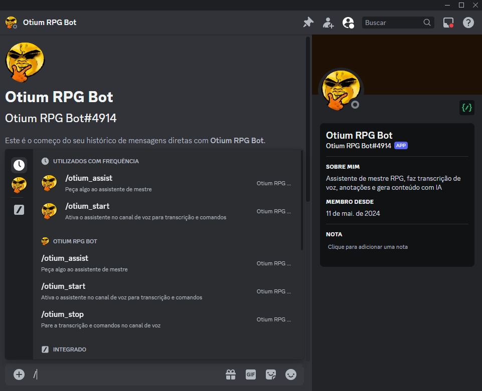

# Otium RPG Bot

Bot para o discord feito para auxiliar jogatinas de RPG de mesa
* inclui uma IA para geração de conteúdo e tirar dúvidas 
* Interação por voz com a IA que pode servir até como mestre virtual
* Transcrição do que for dito nos canais de voz para anotação e organização
* Outros recursos serão implementados como organização de sessões em cloud, aprimoramentos em sistemas de jogo e ferramentas de utilidades nativas

## Principais tecnologias

* Python
* [Pycord](https://github.com/Pycord-Development/pycord)
* [Google Gemini](https://ai.google/discover/generativeai)
* [SpeechRecognition](https://github.com/Uberi/speech_recognition)



## Instalação

1. Clone e acesse o repositório:

```sh
git clone https://github.com/jonathan-ndcg/DiscordSTT.git
cd DiscordSTT
```

2. Instale as dependências:

```sh
pip install -r requirements.txt
```

2. Ative as seguintes permissões do bot no Discord:

```dosini
* Manage webhooks
* Read messages/View channels
* Send messages
* Embed links
* Use slash commands
* Connect
* Use voice activity
```

4. Preencha os campos `DISCORD_TOKEN` e `GEMINI_TOKEN` no arquivo `.env` com seus tokens


## Como usar

1. Execute o bot.py:

```sh
python src/bot.py
```

2. Abra o discord e adicione o bot em um grupo


3. No canal de testo já com o bot use o comando `/otium_assist` e escreva algum pedido para o assistente IA


4. Crie um canal de voz (caso ainda não tenha) e o acesse, no canal de texto escreva o comando `/otium_start` que o assistente acesse o canal de voz e comece a transcrever o que for falado, recomendo que deixe em um canal de texto exclusivo, para parar use o comando `/otium_stop`.


5. Enquanto o assistente estiver ativo no canal de voz pode falar o comando de voz `"ativar assistente público"` ou `"... privado"` para usar a IA por voz, no público ele responde no canal de texto e no privado ele manda uma DM para quem falar, esse recurso é para que o mestre gere conteúdos que os jogados não podem saber, enquanto isso as transcrições ficam desabilitadas até que fale o comando `"desativar assistente"`


Utilizado o código para STT do [jakobowsky](https://github.com/jonathan-ndcg/DiscordSTT)
